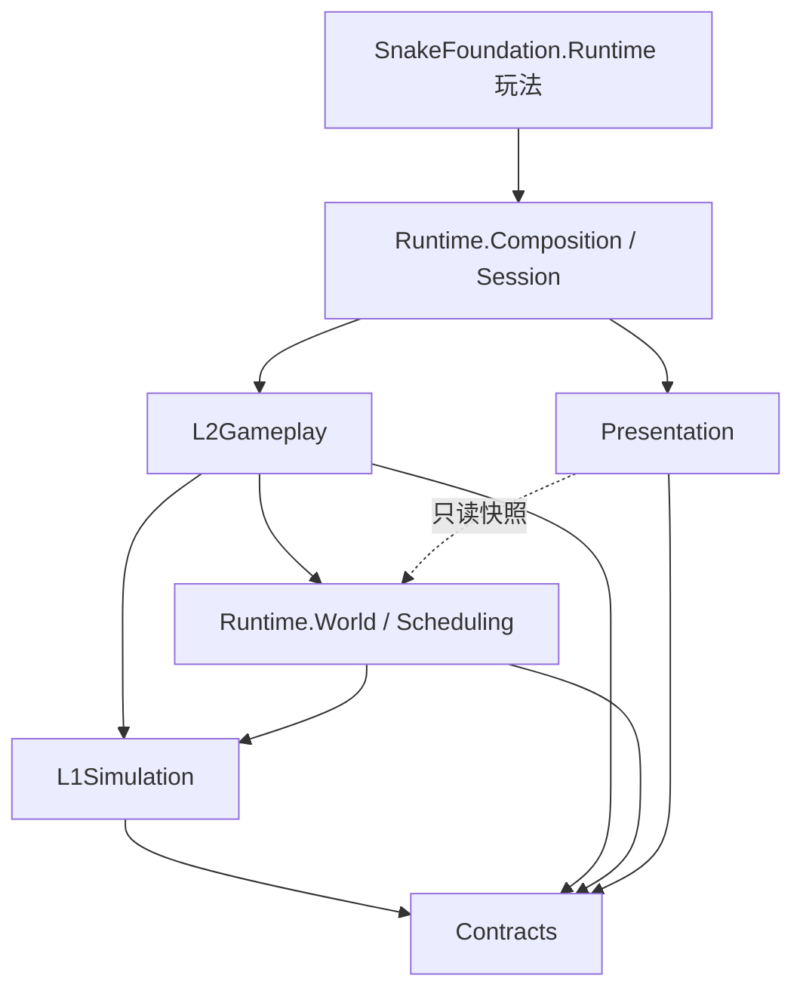

# SinglePlayerFoundation 架构设计方案

> Unity 2D 单机小游戏基座：高性能计算基座（数据导向 + Jobs + Burst）、网格碰撞与大/小地图衔接、规则与配置、共享层、玩法适配与接入。首个接入玩法：贪吃蛇（SnakeFoundation）。
>
> 目标平台：移动端（iOS / Android，IL2CPP，ARM64）。

---

## 0. 设计目标与性能预算

| 维度 | 目标 |
| --- | --- |
| 帧率 | 中端机（骁龙 7 系 / A13）稳定 60 FPS，低端机 30 FPS 可降级 |
| 规模（贪吃蛇基准） | 同屏活跃蛇 100+，身体节点总数 30k+，食物 10k+，飞行物 500+ |
| 模拟 CPU 预算 | 主线程 ≤ 3 ms，工作线程总计 ≤ 6 ms / tick |
| GC | 进入对局后 **0 GC Alloc / 帧** |
| 内存 | 模拟数据 ≤ 32 MB，预分配 + 池化，对局中不扩容或极少扩容 |
| 扩展性 | 新玩法只写 L2 规则 + 表现适配，不改 L1 / Runtime |
| 可测试 | L1 / L2 为纯数据 + 纯函数，可脱离 Scene 做 EditMode 测试与性能基准 |

核心原则：

1. **数据与逻辑分离**：所有模拟状态存在 SoA 的 Native 容器中，逻辑是无状态 System / Job。
2. **表现只读模拟**：Presentation 只读取快照，永不写模拟数据；模拟可在无渲染下运行（测试、快进、服务器化预留）。
3. **固定步长 + 可复现**：固定 tick 模拟，渲染插值；随机数全部种子化，便于回放与定位 bug。
4. **分层单向依赖**：上层依赖下层，下层永远不知道上层存在。
5. **结构变更延迟执行**：Job 中不创建/销毁实体，统一走命令缓冲，在同步点批量应用。

---

## 1. 分层与目录（对应现有工程结构）

```
SinglePlayerFoundation/
├── Contracts/            # 共享契约：ID、句柄、事件、接口、配置基类（无依赖）
├── L1Simulation/         # 计算基座：与玩法无关的通用模拟
│   ├── Body/             # 链式身体（轨迹环形缓冲 + 节点采样）
│   ├── Geometry/         # 圆/胶囊/AABB/射线，Burst 数学
│   ├── Movement/         # 转向、速度、加速、边界约束
│   └── Spatial/          # 空间网格、宽相位、查询、区域/分块
├── L2Gameplay/           # 规则层：可配置玩法规则
│   ├── Buffs/            # 属性修改器
│   ├── Collision/        # 碰撞响应矩阵与规则
│   ├── Contracts/        # L2 对外接口（玩法模块契约）
│   ├── Elements/         # 食物、飞行物、障碍等世界元素
│   ├── Growth/           # 成长/质量/体型
│   ├── Props/            # 道具
│   └── Skills/           # 技能（冲刺、射击…）
├── Presentation/         # 表现层：只读快照 → 渲染
│   ├── Camera/
│   ├── Elements/
│   └── Snakes/
└── Runtime/              # 运行时组装
    ├── Composition/      # 组合根：按玩法定义装配 World 与 System
    ├── Scheduling/       # Tick 管线、Phase、Job 依赖编排
    ├── Session/          # 对局生命周期（加载/开始/暂停/结算/重开）
    └── World/            # SimWorld：数据容器、实体分配、命令缓冲
```

### 依赖规则（通过 asmdef 强制）



建议 asmdef 拆分（每个都开启 `allowUnsafeCode`，L1/L2 引用 Burst、Collections、Mathematics、Jobs）：

| asmdef | 内容 | 允许依赖 |
| --- | --- | --- |
| `SPF.Contracts` | 契约 | Unity.Mathematics, Unity.Collections |
| `SPF.L1Simulation` | 计算基座 | Contracts |
| `SPF.Runtime.Core` | World / Scheduling | Contracts, L1 |
| `SPF.L2Gameplay` | 规则 | Contracts, L1, Runtime.Core |
| `SPF.Presentation` | 表现 | Contracts, Runtime.Core（只读 API） |
| `SPF.Runtime` | Composition / Session | 以上全部 |
| `SnakeFoundation.Runtime` | 贪吃蛇玩法 | 以上全部 |
| `SPF.Tests.*` | EditMode / PlayMode / 性能测试 | 对应层 |

> 说明：`Runtime` 目录物理上一个，逻辑上拆成 `Core`（World、Scheduling，被 L2 依赖）和 `Composition/Session`（装配层，依赖 L2）两个 asmdef，避免循环依赖。

---

## 2. 计算基座：ECS 选型与 Jobs 方案

### 2.1 选型结论

**采用「自研轻量 SoA ECS（Archetype 固定） + C# Job System + Burst」**，不直接使用 Unity Entities 包作为核心。

| 方案 | 优点 | 缺点（针对本项目） |
| --- | --- | --- |
| Unity Entities 1.x | 生态完整、Baking、Entities Graphics | 包体与启动开销、结构变更成本高；蛇身是「变长链」，用 Entity/DynamicBuffer 表达不自然；2D + SpriteRenderer 支持弱；学习与调试成本高 |
| **自研 SoA + Jobs + Burst** | 数据布局完全可控（蛇身连续内存）、零结构变更开销、包小、移动端可精细调优 | 需要自己实现实体分配、调度、工具（成本可控，见下文） |

移动端 2D 小游戏的实体种类有限（蛇、食物、飞行物、道具、障碍），固定 archetype 的「表（Table）」模型最简单也最快。

> 保留兼容口：`Contracts` 中定义的 System 接口与数据结构不依赖自研 World 的实现细节，未来若切 Entities 只需替换 `Runtime.Core`。

### 2.2 World 数据模型

```
SimWorld
├── EntityRegistry            # 句柄分配：index + generation，稀疏→稠密映射
├── Tables（每类实体一张 SoA 表）
│   ├── SnakeTable            # 蛇头：Position, Heading, Speed, Radius, Mass, State, BodyRange...
│   ├── BodyStore             # 所有蛇身轨迹点的大池（Slab 分配）
│   ├── FoodTable             # 食物：Position, Value, Kind, Radius
│   ├── ProjectileTable       # 飞行物：Position, Velocity, Life, Owner, Kind
│   ├── PropTable             # 道具
│   └── ObstacleTable         # 静态障碍（构建一次）
├── Extension Columns         # 玩法扩展列（见 §6.3）
├── SpatialIndex              # 空间网格（每 tick 重建或增量）
├── EventStreams              # 碰撞/吃/死亡/生成等事件（NativeStream）
├── CommandBuffer             # 延迟的创建/销毁/迁移
├── ConfigDatabase            # 只读 Blob 配置
└── RandomState               # 每实体/每系统种子化 Random
```

- **稠密存储**：每张表是若干 `NativeArray<T>` 列（SoA），`Count` 之内连续，删除用 swap-back；句柄 → 稠密下标通过 `EntityRegistry` 查找。
- **句柄**：`struct EntityHandle { int Index; int Generation; byte Kind; }`，过期句柄可安全检测。
- **容量预分配**：由 `ModeDefinition` 声明各表容量上限，Session 开始时一次性分配，`Allocator.Persistent`。

### 2.3 Tick 管线（Runtime/Scheduling）

模拟固定步长（默认 30 Hz，可配 20~60），渲染帧插值。每个 tick 按 Phase 顺序执行，Phase 内 System 声明读写集，调度器自动串联 `JobHandle`：

```
Tick N
 ├─ P0  ApplyCommands      (主线程) 应用上 tick 的结构变更、生成、销毁、迁移
 ├─ P1  Input              (主线程) 玩家输入 → 目标方向/技能请求
 ├─ P2  Decide             (Job)    AI 决策（分时切片，见 §4.2）
 ├─ P3  Steer & Move       (Job)    转向、速度、加速、边界规则
 ├─ P4  Body               (Job)    轨迹写入、身体节点采样、长度变化
 ├─ P5  SpatialBuild       (Job)    网格重建（计数排序）
 ├─ P6  Collision          (Job)    宽相位 + 窄相位 → 碰撞事件流
 ├─ P7  Resolve            (Job)    规则层：击杀、吃、拾取、伤害、Buff
 ├─ P8  Spawn & Replenish  (Job)    食物补充、死亡掉落、飞行物发射 → 写命令缓冲
 ├─ P9  Snapshot           (Job)    写表现快照（双缓冲）
 └─ Sync                   (主线程) Complete，交换快照，派发主线程事件（音效/VFX/UI）
```

关键点：

- **一次 Complete**：整个 tick 构成一条依赖链，只在 Sync 点 `Complete()`；主线程在此期间可做表现插值。
- **Job 粒度**：移动端 worker 数少（4~6），`IJobParallelFor` 的 `innerloopBatchCount` 取 64~256，避免大量小 Job；小规模数据（< 512）直接 `IJob` 单线程 Burst 更快。
- **读写声明**：`ISimSystem.Declare(ref AccessBuilder)` 声明读/写哪些列，调度器据此并行无冲突的 System，并在 Editor 下做安全检查。
- **帧预算自适应**：若检测到连续超预算（热降频），自动降低 AI 频率 / 远景 LOD 频率，而不是降低模拟 tick。

```csharp
// Contracts
public interface ISimSystem
{
    SimPhase Phase { get; }
    int Order { get; }                                   // Phase 内顺序
    void Declare(ref AccessBuilder access);              // 读写集
    void OnCreate(in SystemContext ctx);
    JobHandle Schedule(in SystemContext ctx, JobHandle deps);
    void OnDestroy(in SystemContext ctx);
}
```

### 2.4 Burst / 移动端注意事项

- 全部热路径 `[BurstCompile(FloatMode = FloatMode.Fast, FloatPrecision = FloatPrecision.Low)]`（需确定性回放的系统用 `Deterministic` 另行标注）。
- 只用 `Unity.Mathematics`（`float2`、`math.*`），避免 `Vector2`。
- 禁止在 Job 中使用托管对象；配置用 `BlobAssetReference` 或 `NativeArray` 只读。
- 数据类型压缩：颜色/种类用 `byte`，角度可用 `half`，表现快照位置用 `float2`（不压缩，避免抖动）。
- `NativeArray` 使用 `NativeArrayOptions.UninitializedMemory` 创建临时缓冲。
- IL2CPP + Burst AOT，Android 开 ARM64 + `Burst Target: ARMV8A_AARCH64`。

---

## 3. 空间网格碰撞与大 / 小地图衔接

> 需求中的「网络碰撞」按「**网格碰撞**（Spatial Grid）」理解：单机场景，核心是高效的空间划分与跨地图衔接。

### 3.1 世界坐标与分块

```
WorldCoord = ChunkCoord(int2) + Local(float2, 0..ChunkSize)
```

- **Chunk**：固定大小（如 64×64 世界单位），是加载、生成、LOD、补充食物的基本单位。
- **大地图**：由大量 Chunk 组成，只有「活跃窗口」内的 Chunk 参与完整模拟。
- **浮点精度**：模拟使用「以活跃窗口原点为基准」的相对坐标（Floating Origin），窗口移动时整体平移（rebase），保证超大地图在移动端 float 精度下无抖动。

### 3.2 空间网格（L1Simulation/Spatial）

采用**滚动环形稠密网格（Rolling Toroidal Grid）+ 计数排序**：

- 网格覆盖活跃窗口，尺寸 `W×H` 个 Cell（2 的幂，便于取模），`cellSize ≈ 2 × 常见碰撞体半径`。
- Cell 寻址：`(cx & (W-1), cy & (H-1))`，窗口滚动时不需要重建内存，只需清理新进入的列/行。
- 每 tick 重建（数据量 3~5 万级，重建比增量维护更快、无碎片）：
  1. `ComputeCellJob`（并行）：每个碰撞体算 cellIndex。
  2. `CountJob`：直方图（每线程局部计数后归并，避免原子竞争）。
  3. `PrefixSumJob`：前缀和得到每个 Cell 的起始偏移。
  4. `ScatterJob`：写入 `SortedEntries`（包含 position、radius、owner、layer，**冗余存储以提升缓存命中**）。
- 查询：`ForEachInCircle / ForEachInAABB / Raycast`（DDA 遍历网格），全部 Burst 静态函数。
- 大物体（半径 > cellSize）写入多 Cell 或走独立的「大物体列表」。
- 静态障碍单独一张**静态网格**，只在 Chunk 加载时构建。

碰撞层（Layer）：`SnakeHead / SnakeBody / Food / Projectile / Prop / Obstacle / Trigger`，按层分开排序或在 entry 中带 layer mask，查询时按 mask 过滤。

### 3.3 碰撞检测流程（L1 检测，L2 响应）

```
L1: Detect（与玩法无关）
  for each 主动体（蛇头、飞行物）:
      查询邻近 Cell → 圆/胶囊窄相位 → 写 CollisionEvent{A, B, LayerA, LayerB, Point}
L2: Resolve（规则层）
  按 CollisionMatrix[layerA, layerB] → ResponseId → 规则处理（击杀、吃、伤害、反弹…）
```

- 只让「主动体」发起查询（蛇头 ~100、飞行物 ~500），被动体（身体、食物）只进网格，查询次数与主动体数量成正比，而非 O(n²)。
- 自身身体过滤：entry 中存 `OwnerId`，前 K 个节点跳过（避免头撞紧邻颈部）。
- 输出使用 `NativeStream`（并行写、无锁），L2 按事件顺序消费。
- 同一 tick 事件的冲突解决（两蛇互撞、同一食物被多蛇吃）由 L2 规则按确定性优先级决定（如 EntityIndex 小者先）。

### 3.4 大 / 小地图衔接（Region & Link）

```
WorldGraph
├── Region（一张地图：大地图 / 小地图 / 副本房间）
│   ├── Bounds, ChunkSize, BoundaryRule: Wall | Wrap | Kill | Open
│   ├── SpawnProfile（食物密度、AI 数量、元素表）
│   └── Links[]
└── Link（衔接方式）
    ├── EdgeLink：Region A 的某条边 ↔ Region B 的某条边（无缝接壤）
    └── PortalLink：A 中的传送点 ↔ B 中的落点（带过渡）
```

- **无缝接壤（EdgeLink）**：两个 Region 在 WorldGraph 中拼成同一坐标空间，活跃窗口跨越边界时同时加载两侧 Chunk；网格与碰撞天然连续。
- **传送衔接（PortalLink）**：大地图进入小地图（竞技场、Boss 房、奖励关）：
  1. 预加载目标 Region 的 Chunk（异步、分帧）。
  2. 同步点执行 `Migrate` 命令：实体（蛇头 + 身体轨迹）坐标变换到目标 Region，身体轨迹整体平移。
  3. 相机与表现做过渡（淡入淡出 / 缩放）。
  4. 源 Region 转为休眠 LOD，保留其状态以便返回。
- **模拟 LOD**（按 Chunk 到玩家的距离）：

| 等级 | 范围 | 模拟方式 |
| --- | --- | --- |
| Active | 活跃窗口 | 完整 tick：AI、移动、身体、碰撞 |
| Near | 窗口外一圈 | 降频（1/2~1/4 tick）、粗碰撞（仅头对头、头对障碍） |
| Dormant | 更远 / 非当前 Region | 统计化模拟：只维护数量与总质量，进入 Active 时按统计结果实例化 |

小地图即「单 Region、全部 Chunk 常驻 Active」的特例，用同一套代码。

---

## 4. 规则与配置

### 4.1 配置管线

```
ScriptableObject（策划编辑，Editor）  →  Bake  →  ConfigDatabase（BlobAsset，只读，Burst 可读）
         ↑ 可选：表格(CSV/Excel) 导入
```

- 所有运行时配置在 Session 开始时烘焙为 `BlobAssetReference<ConfigBlob>`（或一组只读 `NativeArray`），Job 中直接访问，零托管开销。
- 配置按 ID 引用（`ConfigId<T>` 强类型整数），不在运行时用字符串。
- 分层覆盖：`Default → Mode → Region → Difficulty`，烘焙时合并。
- Editor 下支持热重载：修改 SO → 重新烘焙 → 下一 tick 生效（便于调参）。

主要配置表：

| 配置 | 内容 |
| --- | --- |
| `MovementConfig` | 基础速度、冲刺速度、转向速率（随体型衰减曲线）、加速度 |
| `BodyConfig` | 节点间距、半径-质量曲线、最小/最大长度 |
| `AIProfile` | 性格参数（贪婪、胆量、攻击性）、感知半径、决策间隔、避让探针 |
| `FoodConfig` / `SpawnProfile` | 食物种类、价值、权重、每 Chunk 目标密度、补充速率、死亡掉落比例 |
| `ProjectileConfig` | 速度、寿命、半径、追踪参数、命中效果 |
| `CollisionMatrix` | Layer × Layer → ResponseId |
| `BuffConfig` / `SkillConfig` / `PropConfig` | 修改器、冷却、消耗、效果列表 |

### 4.2 AI 行为（L2Gameplay，Burst）

两层结构，均在 Job 中运行：

1. **决策层（低频，Utility AI）**：每个 AI 每 N tick 决策一次（按 `index % N == tick % N` 分时切片），评估候选意图并打分：
   - `Wander`（漫游）、`SeekFood`（寻食，选价值/距离最优的食物簇）、`Flee`（逃离更大蛇）、`Attack/Encircle`（拦截、绕圈围杀较小蛇）、`Boost`（冲刺追击或逃跑）。
   - 输出：`AIIntent { Kind, TargetPos, TargetEntity, WantBoost }`。
2. **转向层（每 tick，Steering）**：
   - 目标方向 = 意图方向 + **自动避让**：
     - 在前方扇区放 3~5 根探针（射线/圆扫），在空间网格上查询身体、障碍、边界。
     - 基于「危险度」的上下文导向（Context Steering）：将 8/16 个方向分别打 *兴趣值* 和 *危险值*，取兴趣 - 危险最大方向，天然避免振荡。
   - 受 `turnRate` 约束平滑转向。

感知只通过空间网格查询，AI 数量翻倍时成本近似线性。

### 4.3 吃食物与补充食物

- **吃**：`SnakeHead × Food` 碰撞事件 → L2 `EatRule` → 增加质量（Growth）→ 命令缓冲销毁食物，事件发给表现（吸入动画）。
  - 优化：吸附半径（magnet）内食物向头部飞行的表现由 Presentation 做，模拟只判定进入吃半径。
- **补充（Replenish）**：以 Chunk 为单位维护 `targetDensity` 与当前数量，每 tick 只处理少量 Chunk（轮询），不足则按 `SpawnProfile` 权重在 Chunk 内随机生成（避开障碍）。
- **死亡掉落**：蛇死亡时沿身体节点按质量比例生成食物（可合并为大颗粒，控制上限）。
- **冲刺掉质量**：冲刺时按速率减少质量，并在尾部生成小食物。

### 4.4 飞行物（Projectile）

- 统一 `ProjectileTable`：直线、追踪（有限转向）、抛物/回旋（参数化轨迹）。
- 每 tick 移动 → 以「线段 vs 网格」扫掠检测（防高速穿透）→ 命中事件 → L2 `ProjectileHitRule`（伤害、切断蛇身、减速 Buff 等）。
- 寿命结束/命中后回池（swap-back 删除，无 GC）。

### 4.5 Buff / 技能 / 道具

- **Buff**：每实体固定容量的修改器槽位（如 8 个，`FixedList64Bytes<BuffInstance>`），属性 = Base × Π(乘) + Σ(加)，每 tick 在一个 Job 中汇总写入 `EffectiveStats` 列，其他系统只读 `EffectiveStats`。
- **技能**：数据驱动 `SkillConfig`（冷却、消耗、效果列表），效果是有限种类的 `EffectOp`（发射飞行物、加 Buff、瞬移、生成元素…），执行在 Job 中按 op 分派（`switch`，Burst 友好）。
- **道具**：场景中的可拾取元素，拾取后转为 Buff 或技能充能。

---

## 5. 共享层（Contracts & Shared）

共享层是所有玩法、所有层都能引用的最小公共集合，保持**无状态、无 Unity 场景依赖**：

| 分类 | 内容 |
| --- | --- |
| 标识 | `EntityHandle`、`ConfigId<T>`、`LayerId`、`RegionId`、`ChunkCoord` |
| 事件 | `CollisionEvent`、`EatEvent`、`DeathEvent`、`SpawnEvent`、`MigrateEvent` 等 blittable 结构 |
| 接口 | `ISimSystem`、`IGameplayModule`、`IPresentationAdapter`、`IInputSource`、`IConfigBaker` |
| 数学/几何 | 圆、胶囊、AABB、射线、线段扫掠、角度工具（Burst 兼容） |
| 容器 | `SlabAllocator`、`RingBuffer`、`NativeBitSet`、双缓冲 `Snapshot<T>` |
| 随机 | `SimRandom`（基于 `Unity.Mathematics.Random`，按 seed + entity + tick 派生，可复现） |
| 服务 | 对象池、日志（条件编译）、Profiler Marker 统一命名 |

共享的另一层含义是**跨玩法复用**：L1 全部、L2 中的 Collision/Buffs/Elements/Growth/Props/Skills 都设计为「贪吃蛇无关」的通用模块，其他玩法（如弹幕生存、吞噬球球）直接组合复用。

---

## 6. 玩法适配与接入

### 6.1 玩法模块契约

```csharp
public interface IGameplayModule
{
    string Id { get; }
    void DeclareData(ref WorldLayoutBuilder layout);     // 需要的表、容量、扩展列
    void BakeConfig(ref ConfigBakeContext ctx);          // 烘焙配置
    void RegisterSystems(ref SystemRegistry registry);   // 注册 System 到 Phase
    void RegisterRules(ref RuleRegistry rules);          // 注册碰撞响应、事件处理
    void RegisterPresentation(PresentationRegistry pres);// 表现适配器
}
```

- **ModeDefinition（ScriptableObject）**：一个玩法 = 一组模块 + 配置 + 地图（WorldGraph） + 胜负条件。
- **Composition Root**（`Runtime/Composition`）：读取 ModeDefinition → 汇总 `WorldLayout` → 分配 World → 烘焙配置 → 构建 Tick 管线 → 绑定表现 → 交给 `Session`。
- 模块可替换：例如把 `SnakeCollisionRule`（头撞身死亡）换成 `BounceRule`（反弹），不改其他代码。

### 6.2 Session 生命周期

```
Create → Load(Regions/Chunks 异步) → Warmup(预分配、JIT/Burst 预热、池预填) → Running ⇄ Paused → Ending(结算) → Dispose / Restart
```

Restart 复用已分配内存（清表而非重新分配），实现秒级重开。

### 6.3 扩展列（玩法私有数据）

玩法不修改 L1 表结构，而是在表上**挂扩展列**：

```csharp
layout.Table<SnakeTable>().AddColumn<SnakeSkin>();      // 表现用皮肤 ID
layout.Table<SnakeTable>().AddColumn<KillStreak>();     // 玩法私有统计
```

扩展列与主表共享稠密下标、随 swap-back 同步移动，System 通过 `ctx.Column<T>(table)` 获取 `NativeArray<T>`。

### 6.4 贪吃蛇接入（SnakeFoundation.Runtime）

| 模块 | 使用的基座能力 | 贪吃蛇特化 |
| --- | --- | --- |
| `SnakeMovementModule` | L1 Movement | 恒速前进 + 冲刺、转向速率随体型下降 |
| `SnakeBodyModule` | L1 Body | 轨迹环形缓冲，长度 = f(质量)，半径 = g(质量) |
| `SnakeCollisionModule` | L1 Spatial + L2 Collision | 头撞他人身体 → 死亡；头对头 → 按规则判定 |
| `SnakeGrowthModule` | L2 Growth | 吃食物增质量，冲刺掉质量 |
| `SnakeFoodModule` | L2 Elements | Chunk 密度补充、死亡掉落 |
| `SnakeAIModule` | L2 AI | 寻食 / 逃跑 / 围杀 / 避让 |
| `SnakeSkillModule`（可选） | L2 Skills + Projectile | 射击、护盾、磁铁 |
| `SnakePresentation` | Presentation/Snakes | 身体渲染、皮肤、死亡特效 |

#### 蛇身数据结构（核心性能点）

```
BodyStore（全局 Slab）：NativeArray<float2> TrailPoints
每条蛇：TrailRange{ Start, Capacity(2 的幂), Head, Count }, SegmentSpacing
```

- 蛇头每移动 `SegmentSpacing` 距离写入一个轨迹点（环形缓冲），**第 i 个身体节点 = 第 i 个轨迹点**，再用头部未满一格的剩余距离做线性插值 → 身体更新 **O(1) 写入 / 蛇**，采样可并行。
- 长度变化只改 `Count`，无需搬移数据；容量不足时从 Slab 申请更大块（2 的幂分级，罕见）。
- 体型变化导致间距变化时，按新间距重采样一次（低频）。
- 碰撞时身体节点以 `(position, radius, ownerId, segmentIndex)` 写入网格；远离所有主动体的蛇身可跳过写入（LOD）。

---

## 7. 表现层（Presentation）

- **快照双缓冲**：P9 写 `Snapshot[N]`，渲染帧在 `Snapshot[N-1]` 与 `Snapshot[N]` 之间按 `alpha` 插值，模拟 30Hz 也能 60/120 FPS 平滑显示。
- **渲染方案**：
  - 食物/飞行物/身体节点：`Graphics.RenderMeshInstanced`（或 `BatchRendererGroup`）+ GPU Instancing，材质用 Atlas + 实例属性（颜色、UV 偏移、缩放），一个 DrawCall 画数千个。
  - 蛇身可选「节点精灵实例化」或「Job 生成连续条带 Mesh」（`Mesh.MeshDataArray` + `ApplyAndDisposeWritableMeshData`，Burst 生成顶点）。
  - 不为每个实体创建 GameObject；只为玩家蛇头、UI 挂点等少量对象使用 GameObject。
- **裁剪**：利用空间网格按相机 AABB 取可见 Cell，只提交可见实例。
- **Camera**：跟随 + 体型缩放（蛇越大视野越大）、Region 切换过渡、屏幕震动（事件驱动）。
- **事件到表现**：Sync 点把本 tick 事件拷贝为主线程列表，派发给 VFX / 音效 / UI 适配器（对象池复用）。

---

## 8. 移动端性能专项

| 项 | 措施 |
| --- | --- |
| CPU | Burst + SoA + 计数排序网格；AI 分时切片；远景 LOD；Job 批量大小调优 |
| GC | 全部 Native 容器预分配；事件/命令缓冲复用；表现层对象池；禁用 LINQ/闭包/装箱于热路径 |
| 线程 | `JobsUtility.JobWorkerCount` 按大小核调整（通常 = 大核数），避免与渲染线程争抢 |
| 发热 | 自适应质量：检测帧时/温度（`AdaptivePerformance` 可选）→ 降 AI 频率、降粒子、降渲染分辨率，不降模拟 tick |
| 渲染 | 实例化 + Atlas + 少材质；2D 光照可选关闭；SRP Batcher（URP 2D） |
| 内存 | 容量上限由 ModeDefinition 声明；Slab 分级减少碎片；Restart 复用内存 |
| 加载 | Chunk 分帧加载；Burst 预热（Warmup 阶段跑一次空 tick） |
| 度量 | 统一 `ProfilerMarker`；内置 Perf HUD（tick 耗时、各 Phase 耗时、实体数）；性能测试用 `Unity.PerformanceTesting` 固定场景基准 |

---

## 9. 可测试性与工具

- **EditMode 单元测试**：L1（网格正确性、身体采样、转向）、L2（规则矩阵、Buff 汇总）直接在无场景 World 上跑。
- **确定性回放**：记录 `seed + 每 tick 输入`，可复现任意 bug；同时作为回归测试（校验若干 tick 后的状态 hash）。
- **性能基准**：`100 蛇 × 300 节点 + 10k 食物` 固定场景，CI 记录各 Phase 耗时。
- **调试可视化**：Gizmos 绘制网格占用、AI 探针、碰撞事件、Chunk LOD 等级。

---

## 10. 迭代路线

| 里程碑 | 内容 | 验收 |
| --- | --- | --- |
| M1 基座骨架 | Contracts、asmdef、SimWorld、EntityRegistry、Tick 管线、命令缓冲、快照 | 空 tick 0 GC，Phase 调度可视化 |
| M2 L1 模拟 | Movement、Body（轨迹缓冲）、Spatial 网格 + 查询、碰撞事件 | 100 蛇 × 300 节点网格重建 + 检测 < 2 ms（中端机） |
| M3 贪吃蛇最小可玩 | 输入、吃食物、成长、死亡掉落、补充食物、实例化渲染、相机 | 单 Region 可玩，60 FPS |
| M4 规则与 AI | ConfigDatabase 烘焙、碰撞矩阵、Utility AI + Context Steering、冲刺 | 100 AI 蛇稳定对局 |
| M5 地图衔接 | Chunk、活跃窗口、Floating Origin、模拟 LOD、EdgeLink / PortalLink | 大地图 ↔ 小地图无缝/传送切换无卡顿 |
| M6 扩展玩法 | Buff、技能、道具、飞行物 | 通过配置新增一个技能不改代码 |
| M7 打磨 | 自适应性能、回放、性能 CI、调试工具 | 低端机 30 FPS 稳定 |

---

## 11. 待确认问题

1. 「网络碰撞」是否确实指**网格碰撞**？若未来有联机需求，需要提前把模拟改为全确定性（定点数或严格浮点）并设计状态同步，本方案已按「固定步长 + 种子随机 + 输入回放」预留。
2. 大地图规模上限（如 20k × 20k 单位？），以及小地图是「接壤」为主还是「传送」为主？
3. Unity 版本与渲染管线（建议 Unity 2022.3 LTS / 6 LTS + URP 2D）。
4. 美术表现：蛇身是节点精灵还是连续条带？影响 Presentation/Snakes 方案选择。
5. 是否需要支持 Unity Entities（团队已有经验时可评估替换 `Runtime.Core`）。
