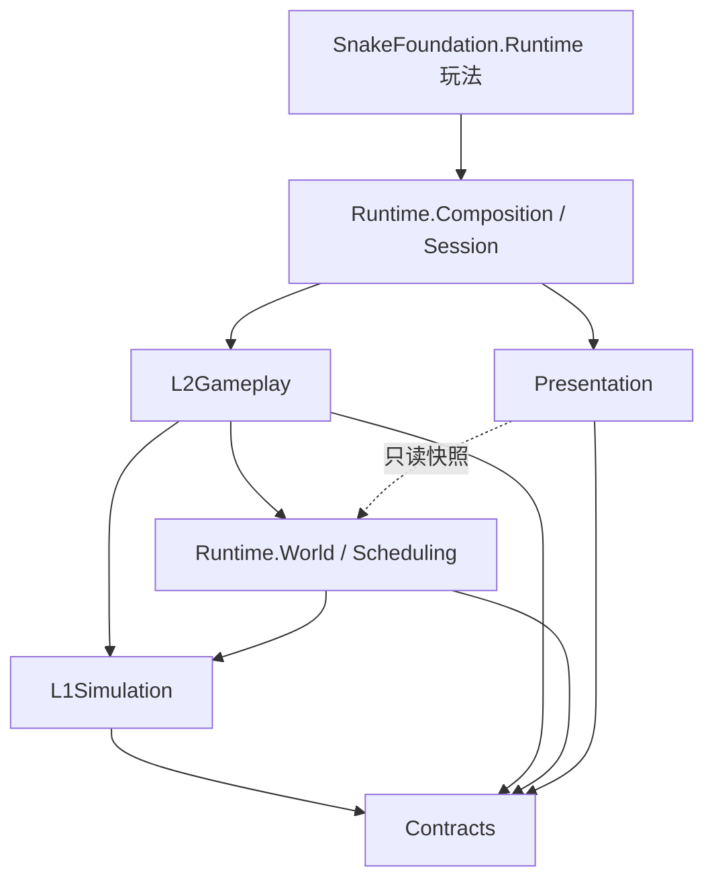

# SinglePlayerFoundation 架构设计方案

> Unity 2D 单机小游戏基座：高性能计算基座（数据导向 + Jobs + Burst）、网格碰撞与大/小地图衔接、规则与配置、共享层、玩法适配与接入。首个接入玩法：贪吃蛇（SnakeFoundation）。
>
> 目标平台：移动端（iOS / Android，IL2CPP，ARM64）。
>
> **已确认的约束**
>
> | 项 | 决定 |
> | --- | --- |
> | 碰撞 | 单机**网格碰撞**（Spatial Grid），不做联机，但保留确定性回放 |
> | 大地图 | **7500 × 7500** 世界单位 |
> | 地图衔接 | 大地图通过**传送点衔接小地图**（PortalLink 为主，EdgeLink 保留） |
> | 小地图 | 面积为大地图的 **1/4**，即 **3750 × 3750**（30 × 30 Chunk） |
> | AI 规模 | 每张地图 **150 条 AI 蛇** |
> | 兼容性 | **必须支持 GLES 3.0**（同时支持 Metal / Vulkan），渲染主路径按 GLES 3.0 能力设计 |
> | 引擎 | **Unity 2022.3 LTS** + URP 14（2D Renderer） |
> | 蛇身表现 | **节点精灵**与**连续条带**两种模式都要，可按皮肤切换 |
> | 重点指标 | 计算性能、渲染带宽、GC、合批（见 §8 专项） |

---

## 0. 设计目标与性能预算

| 维度 | 目标 |
| --- | --- |
| 帧率 | 中端机（骁龙 7 系 / A13）稳定 60 FPS，低端机 30 FPS 可降级 |
| 规模（贪吃蛇基准） | 全图 AI 蛇 150，活跃窗口内 ≤ 60；可见身体节点 30k；活跃食物 10k；飞行物 500 |
| 渲染 | 玩法层 Draw Call ≤ 12，总计 ≤ 40；上传 ≤ 1 MB / tick；透明 overdraw 受控 |
| 模拟 CPU 预算 | 主线程 ≤ 3 ms，工作线程总计 ≤ 6 ms / tick |
| GC | 进入对局后 **0 GC Alloc / 帧** |
| 内存 | 模拟数据 ≤ 32 MB，预分配 + 池化，对局中不扩容或极少扩容 |
| 扩展性 | 新玩法只写 L2 规则 + 表现适配，不改 L1 / Runtime |
| 可测试 | L1 / L2 为纯数据 + 纯函数，可脱离 Scene 做 EditMode 测试与性能基准 |

核心原则：

1. **数据与逻辑分离**：所有模拟状态存在 SoA 的 Native 容器中，逻辑是无状态 System / Job。
2. **表现只读模拟**：Presentation 只读取快照，永不写模拟数据；模拟可在无渲染下运行（测试、快进、服务器化预留）。
3. **固定步长 + 可复现**：固定 tick 模拟，渲染插值；随机数全部种子化，便于回放与定位 bug。
4. **分层单向依赖**：上层依赖下层，下层永远不知道上层存在。
5. **结构变更延迟执行**：Job 中不创建/销毁实体，统一走命令缓冲，在同步点批量应用。

---

## 1. 分层与目录（对应现有工程结构）

```
SinglePlayerFoundation/
├── Contracts/            # 共享契约：ID、句柄、事件、接口、配置基类（无依赖）
├── L1Simulation/         # 计算基座：与玩法无关的通用模拟
│   ├── Body/             # 链式身体（轨迹环形缓冲 + 节点采样）
│   ├── Geometry/         # 圆/胶囊/AABB/射线，Burst 数学
│   ├── Movement/         # 转向、速度、加速、边界约束
│   └── Spatial/          # 空间网格、宽相位、查询、区域/分块
├── L2Gameplay/           # 规则层：可配置玩法规则
│   ├── Buffs/            # 属性修改器
│   ├── Collision/        # 碰撞响应矩阵与规则
│   ├── Contracts/        # L2 对外接口（玩法模块契约）
│   ├── Elements/         # 食物、飞行物、障碍等世界元素
│   ├── Growth/           # 成长/质量/体型
│   ├── Props/            # 道具
│   └── Skills/           # 技能（冲刺、射击…）
├── Presentation/         # 表现层：只读快照 → 渲染
│   ├── Camera/
│   ├── Elements/
│   └── Snakes/
└── Runtime/              # 运行时组装
    ├── Composition/      # 组合根：按玩法定义装配 World 与 System
    ├── Scheduling/       # Tick 管线、Phase、Job 依赖编排
    ├── Session/          # 对局生命周期（加载/开始/暂停/结算/重开）
    └── World/            # SimWorld：数据容器、实体分配、命令缓冲
```

### 依赖规则（通过 asmdef 强制）



建议 asmdef 拆分（每个都开启 `allowUnsafeCode`，L1/L2 引用 Burst、Collections、Mathematics、Jobs）：

| asmdef | 内容 | 允许依赖 |
| --- | --- | --- |
| `SPF.Contracts` | 契约 | Unity.Mathematics, Unity.Collections |
| `SPF.L1Simulation` | 计算基座 | Contracts |
| `SPF.Runtime.Core` | World / Scheduling | Contracts, L1 |
| `SPF.L2Gameplay` | 规则 | Contracts, L1, Runtime.Core |
| `SPF.Presentation` | 表现 | Contracts, Runtime.Core（只读 API） |
| `SPF.Runtime` | Composition / Session | 以上全部 |
| `SnakeFoundation.Runtime` | 贪吃蛇玩法 | 以上全部 |
| `SPF.Tests.*` | EditMode / PlayMode / 性能测试 | 对应层 |

> 说明：`Runtime` 目录物理上一个，逻辑上拆成 `Core`（World、Scheduling，被 L2 依赖）和 `Composition/Session`（装配层，依赖 L2）两个 asmdef，避免循环依赖。

---

## 2. 计算基座：ECS 选型与 Jobs 方案

### 2.1 选型结论

**采用「自研轻量 SoA ECS（Archetype 固定） + C# Job System + Burst」**，不直接使用 Unity Entities 包作为核心。

| 方案 | 优点 | 缺点（针对本项目） |
| --- | --- | --- |
| Unity Entities 1.x | 生态完整、Baking、Entities Graphics | 包体与启动开销、结构变更成本高；蛇身是「变长链」，用 Entity/DynamicBuffer 表达不自然；2D + SpriteRenderer 支持弱；学习与调试成本高 |
| **自研 SoA + Jobs + Burst** | 数据布局完全可控（蛇身连续内存）、零结构变更开销、包小、移动端可精细调优 | 需要自己实现实体分配、调度、工具（成本可控，见下文） |

移动端 2D 小游戏的实体种类有限（蛇、食物、飞行物、道具、障碍），固定 archetype 的「表（Table）」模型最简单也最快。

> 保留兼容口：`Contracts` 中定义的 System 接口与数据结构不依赖自研 World 的实现细节，未来若切 Entities 只需替换 `Runtime.Core`。

### 2.2 World 数据模型

```
SimWorld
├── EntityRegistry            # 句柄分配：index + generation，稀疏→稠密映射
├── Tables（每类实体一张 SoA 表）
│   ├── SnakeTable            # 蛇头：Position, Heading, Speed, Radius, Mass, State, BodyRange...
│   ├── BodyStore             # 所有蛇身轨迹点的大池（Slab 分配）
│   ├── FoodTable             # 食物：Position, Value, Kind, Radius
│   ├── ProjectileTable       # 飞行物：Position, Velocity, Life, Owner, Kind
│   ├── PropTable             # 道具
│   └── ObstacleTable         # 静态障碍（构建一次）
├── Extension Columns         # 玩法扩展列（见 §6.3）
├── SpatialIndex              # 空间网格（每 tick 重建或增量）
├── EventStreams              # 碰撞/吃/死亡/生成等事件（NativeStream）
├── CommandBuffer             # 延迟的创建/销毁/迁移
├── ConfigDatabase            # 只读 ConfigBlob 配置
└── RandomState               # 每实体/每系统种子化 Random
```

- **稠密存储**：每张表是若干 `NativeArray<T>` 列（SoA），`Count` 之内连续，删除用 swap-back；句柄 → 稠密下标通过 `EntityRegistry` 查找。
- **句柄**：`struct EntityHandle { int Index; int Generation; byte Kind; }`，过期句柄可安全检测。
- **容量预分配**：由 `ModeDefinition` 声明各表容量上限，Session 开始时一次性分配，`Allocator.Persistent`。

### 2.3 Tick 管线（Runtime/Scheduling）

模拟固定步长（默认 30 Hz，可配 20~60），渲染帧插值。每个 tick 按 Phase 顺序执行，Phase 内 System 声明读写集，调度器自动串联 `JobHandle`：

```
Tick N
 ├─ P0  ApplyCommands      (主线程) 应用上 tick 的结构变更、生成、销毁、迁移
 ├─ P1  Input              (主线程) 玩家输入 → 目标方向/技能请求
 ├─ P2  Decide             (Job)    AI 决策（分时切片，见 §4.2）
 ├─ P3  Steer & Move       (Job)    转向、速度、加速、边界规则
 ├─ P4  Body               (Job)    轨迹写入、身体节点采样、长度变化
 ├─ P5  SpatialBuild       (Job)    网格重建（计数排序）
 ├─ P6  Collision          (Job)    宽相位 + 窄相位 → 碰撞事件流
 ├─ P7  Resolve            (Job)    规则层：击杀、吃、拾取、伤害、Buff
 ├─ P8  Spawn & Replenish  (Job)    食物补充、死亡掉落、飞行物发射 → 写命令缓冲
 ├─ P9  Snapshot           (Job)    写表现快照（双缓冲）
 └─ Sync                   (主线程) Complete，交换快照，派发主线程事件（音效/VFX/UI）
```

关键点：

- **一次 Complete**：整个 tick 构成一条依赖链，只在 Sync 点 `Complete()`；主线程在此期间可做表现插值。
- **Job 粒度**：移动端 worker 数少（4~6），`IJobParallelFor` 的 `innerloopBatchCount` 取 64~256，避免大量小 Job；小规模数据（< 512）直接 `IJob` 单线程 Burst 更快。
- **读写声明**：`ISimSystem.Declare(ref AccessBuilder)` 声明读/写哪些列，调度器据此并行无冲突的 System，并在 Editor 下做安全检查。
- **帧预算自适应**：若检测到连续超预算（热降频），自动降低 AI 频率 / 远景 LOD 频率，而不是降低模拟 tick。

```csharp
// Contracts
public interface ISimSystem
{
    SimPhase Phase { get; }
    int Order { get; }                                   // Phase 内顺序
    void Declare(ref AccessBuilder access);              // 读写集
    void OnCreate(in SystemContext ctx);
    JobHandle Schedule(in SystemContext ctx, JobHandle deps);
    void OnDestroy(in SystemContext ctx);
}
```

### 2.4 Burst / 移动端注意事项

- 全部热路径 `[BurstCompile(FloatMode = FloatMode.Fast, FloatPrecision = FloatPrecision.Low)]`（需确定性回放的系统用 `Deterministic` 另行标注）。
- 只用 `Unity.Mathematics`（`float2`、`math.*`），避免 `Vector2`。
- 禁止在 Job 中使用托管对象；配置用自研只读 Blob（一块连续 `UnsafeUtility.Malloc` 内存 + 偏移指针，不依赖 Entities 包）或只读 `NativeArray`。
- 数据类型压缩：颜色/种类用 `byte`，角度可用 `half`，表现快照位置用 `float2`（不压缩，避免抖动）。
- `NativeArray` 使用 `NativeArrayOptions.UninitializedMemory` 创建临时缓冲。
- IL2CPP + Burst AOT，Android 开 ARM64 + `Burst Target: ARMV8A_AARCH64`。

---

## 3. 空间网格碰撞与大 / 小地图衔接

> 需求中的「网络碰撞」按「**网格碰撞**（Spatial Grid）」理解：单机场景，核心是高效的空间划分与跨地图衔接。

### 3.1 世界坐标与分块（按 7500 × 7500 定标）

单位约定：1 世界单位 ≈ 1 米；蛇身半径 0.5 ~ 4；镜头可视范围约 40 ~ 120 单位宽（随体型缩放）。

| 参数 | 取值 | 说明 |
| --- | --- | --- |
| ChunkSize | **125** | 7500 / 125 = **60 × 60 = 3600 个 Chunk**，整除无残块 |
| 细网格 CellSize | **4**（2 的幂倍数可调） | ≈ 2 × 常见碰撞半径 |
| 活跃窗口 | **1024 × 1024 单位 = 256 × 256 Cell** | 覆盖镜头 + 两侧余量；Cell 头数组 256 KB |
| 粗网格 | 每个 Chunk 一个桶（60 × 60） | 给 Near / Dormant LOD 的远距离 AI 使用 |

- **Chunk** 是加载、生成、LOD、食物补充的基本单位。
- **坐标**：7500 量级下 float 精度约 0.0005，**不需要 Floating Origin**，直接用全局 `float2`，省掉 rebase 成本（小地图各自独立坐标系）。
- **全图细网格不可行**：7500 / 4 = 1875² ≈ 350 万 Cell，仅头数组就 14 MB 且每帧清零昂贵，因此采用「**活跃窗口细网格 + 全图粗网格**」两级结构（见 §3.2）。
- **食物不做全图实例化**：若全图按每 100 m² 一颗，约 56 万颗，内存与补充成本不可接受。只有 Active / Near Chunk 内实例化食物；Dormant Chunk 只保存「食物数量 + 总价值」，激活时按种子确定性地展开。
- **AI 蛇全图存在**（如 150 条），但只有活跃窗口内的走完整模拟，其余按 LOD 降频（§3.4）。

### 3.2 空间网格（L1Simulation/Spatial）

采用**两级网格：活跃窗口稠密细网格 + 全图粗网格，均用计数排序构建**：

- 细网格覆盖活跃窗口，`256 × 256` Cell，`cellSize = 4`；Cell 下标 = `(cx - originX) + (cy - originY) * 256`，越界即归入粗网格。
- 每 tick 重建（数据量 3~5 万级，重建比增量维护更快、无碎片）：
  1. `ComputeCellJob`（并行）：每个碰撞体算 cellIndex。
  2. `CountJob`：直方图（每线程局部计数后归并，避免原子竞争）。
  3. `PrefixSumJob`：前缀和得到每个 Cell 的起始偏移。
  4. `ScatterJob`：写入 `SortedEntries`（包含 position、radius、owner、layer，**冗余存储以提升缓存命中**）。
- 查询：`ForEachInCircle / ForEachInAABB / Raycast`（DDA 遍历网格），全部 Burst 静态函数。
- 大物体（半径 > cellSize）写入多 Cell 或走独立的「大物体列表」。
- 静态障碍单独一张**静态网格**，只在 Chunk 加载时构建。
- **粗网格（全图 60 × 60 Chunk 桶）**：窗口外的蛇只以「头 + 每 N 个节点抽样」写入粗网格，供 Near LOD 做头对头 / 头对障碍的粗碰撞和 AI 远距离感知；同样用计数排序构建，数据量很小。
- 窗口跟随玩家滚动（带迟滞，移动超过 1 个 Chunk 才滚动）。因为细网格每 tick 全量重建（256 KB 计数数组清零 < 0.02 ms），滚动只需更新窗口原点，无增量维护成本；落在窗口外的实体自动归入粗网格。

碰撞层（Layer）：`SnakeHead / SnakeBody / Food / Projectile / Prop / Obstacle / Trigger`，按层分开排序或在 entry 中带 layer mask，查询时按 mask 过滤。

### 3.3 碰撞检测流程（L1 检测，L2 响应）

```
L1: Detect（与玩法无关）
  for each 主动体（蛇头、飞行物）:
      查询邻近 Cell → 圆/胶囊窄相位 → 写 CollisionEvent{A, B, LayerA, LayerB, Point}
L2: Resolve（规则层）
  按 CollisionMatrix[layerA, layerB] → ResponseId → 规则处理（击杀、吃、伤害、反弹…）
```

- 只让「主动体」发起查询（蛇头 ~100、飞行物 ~500），被动体（身体、食物）只进网格，查询次数与主动体数量成正比，而非 O(n²)。
- 自身身体过滤：entry 中存 `OwnerId`，前 K 个节点跳过（避免头撞紧邻颈部）。
- 输出使用 `NativeStream`（并行写、无锁），L2 按事件顺序消费。
- 同一 tick 事件的冲突解决（两蛇互撞、同一食物被多蛇吃）由 L2 规则按确定性优先级决定（如 EntityIndex 小者先）。

### 3.4 大 / 小地图衔接（Region & Link）

```
WorldGraph
├── Region（一张地图：大地图 / 小地图 / 副本房间）
│   ├── Bounds, ChunkSize, BoundaryRule: Wall | Wrap | Kill | Open
│   ├── SpawnProfile（食物密度、AI 数量、元素表）
│   └── Links[]
└── Link（衔接方式）
    ├── EdgeLink：Region A 的某条边 ↔ Region B 的某条边（无缝接壤）
    └── PortalLink：A 中的传送点 ↔ B 中的落点（带过渡）
```

- **无缝接壤（EdgeLink）**：两个 Region 在 WorldGraph 中拼成同一坐标空间，活跃窗口跨越边界时同时加载两侧 Chunk；网格与碰撞天然连续。
- **传送衔接（PortalLink，主方案）**：7500 大地图上分布若干传送点，连接 **3750 × 3750** 的小地图：
  1. 预加载目标 Region 的 Chunk（异步、分帧）。
  2. 同步点执行 `Migrate` 命令：实体（蛇头 + 身体轨迹）坐标变换到目标 Region，身体轨迹整体平移。
  3. 相机与表现做过渡（淡入淡出 / 缩放）。
  4. 源 Region 写入 `RegionSnapshot` 冻结，保留其状态以便返回（见下文）。
- **模拟 LOD**（按 Chunk 到玩家的距离）：

| 等级 | 范围 | 模拟方式 |
| --- | --- | --- |
| Active | 活跃窗口 | 完整 tick：AI、移动、身体、碰撞 |
| Near | 窗口外一圈 | 降频（1/2~1/4 tick）、粗碰撞（仅头对头、头对障碍） |
| Dormant | 更远 | 统计化模拟：只维护数量与总质量，进入 Active 时按统计结果实例化 |
| Frozen | 非当前 Region | 完全不模拟，只保存 `RegionSnapshot` |

**小地图不是「小房间」**：3750 × 3750 本身就远大于活跃窗口（1024），因此小地图与大地图**完全走同一套机制**（Chunk、活跃窗口细网格、粗网格、模拟 LOD），只是 Region 参数不同：

| 参数 | 大地图 | 小地图 |
| --- | --- | --- |
| 尺寸 | 7500 × 7500 | 3750 × 3750 |
| Chunk | 60 × 60 = 3600 | 30 × 30 = 900 |
| 粗网格 | 60 × 60 桶 | 30 × 30 桶 |
| 细网格（活跃窗口） | 256 × 256 Cell | 256 × 256 Cell（共用内存） |
| AI 蛇 | 150 | 150 |
| 食物密度 / 元素表 | SpawnProfile A | SpawnProfile B（可更密集、更高价值） |

**同一时刻只运行一个 Region**，另一个冻结：

- 各 Region **共用同一套实体表、BodyStore、网格、渲染缓冲**（容量按两者最大值预分配），切换时不重新分配内存。
- 离开的 Region 压缩为 `RegionSnapshot`：150 条蛇的头部状态 + 轨迹（按上限 150 × 1024 点 × 8 B ≈ 1.2 MB）+ 每 Chunk 食物统计（900~3600 × 8 B）。**食物实例不保存**，返回时按统计和种子重新展开。
- 冻结期间可选「离线推进」：返回时按离开时长对 AI 蛇做一次粗略的统计推进（成长、死亡补员），避免世界完全静止。
- 切换流程分帧进行：T-N 帧开始解压目标快照与预生成窗口内食物 → 切换帧只做「表数据交换 + 玩家迁移 + 相机过渡」，切换帧耗时 ≤ 1 帧预算。

---

## 4. 规则与配置

### 4.1 配置管线

```
ScriptableObject（策划编辑，Editor）  →  Bake  →  ConfigDatabase（ConfigBlob，只读，Burst 可读）
         ↑ 可选：表格(CSV/Excel) 导入
```

- 所有运行时配置在 Session 开始时烘焙为自研 `ConfigBlob`（连续非托管内存 + 相对偏移，Burst 直接读），Job 中直接访问，零托管开销。
- 配置按 ID 引用（`ConfigId<T>` 强类型整数），不在运行时用字符串。
- 分层覆盖：`Default → Mode → Region → Difficulty`，烘焙时合并。
- Editor 下支持热重载：修改 SO → 重新烘焙 → 下一 tick 生效（便于调参）。

主要配置表：

| 配置 | 内容 |
| --- | --- |
| `MovementConfig` | 基础速度、冲刺速度、转向速率（随体型衰减曲线）、加速度 |
| `BodyConfig` | 节点间距、半径-质量曲线、最小/最大长度 |
| `AIProfile` | 性格参数（贪婪、胆量、攻击性）、感知半径、决策间隔、避让探针 |
| `FoodConfig` / `SpawnProfile` | 食物种类、价值、权重、每 Chunk 目标密度、补充速率、死亡掉落比例 |
| `ProjectileConfig` | 速度、寿命、半径、追踪参数、命中效果 |
| `CollisionMatrix` | Layer × Layer → ResponseId |
| `BuffConfig` / `SkillConfig` / `PropConfig` | 修改器、冷却、消耗、效果列表 |

### 4.2 AI 行为（L2Gameplay，Burst）

两层结构，均在 Job 中运行：

1. **决策层（低频，Utility AI）**：每个 AI 每 N tick 决策一次（按 `index % N == tick % N` 分时切片），评估候选意图并打分：
   - `Wander`（漫游）、`SeekFood`（寻食，选价值/距离最优的食物簇）、`Flee`（逃离更大蛇）、`Attack/Encircle`（拦截、绕圈围杀较小蛇）、`Boost`（冲刺追击或逃跑）。
   - 输出：`AIIntent { Kind, TargetPos, TargetEntity, WantBoost }`。
2. **转向层（每 tick，Steering）**：
   - 目标方向 = 意图方向 + **自动避让**：
     - 在前方扇区放 3~5 根探针（射线/圆扫），在空间网格上查询身体、障碍、边界。
     - 基于「危险度」的上下文导向（Context Steering）：将 8/16 个方向分别打 *兴趣值* 和 *危险值*，取兴趣 - 危险最大方向，天然避免振荡。
   - 受 `turnRate` 约束平滑转向。

感知只通过空间网格查询，AI 数量翻倍时成本近似线性。

### 4.3 吃食物与补充食物

- **吃**：`SnakeHead × Food` 碰撞事件 → L2 `EatRule` → 增加质量（Growth）→ 命令缓冲销毁食物，事件发给表现（吸入动画）。
  - 优化：吸附半径（magnet）内食物向头部飞行的表现由 Presentation 做，模拟只判定进入吃半径。
- **补充（Replenish）**：以 Chunk 为单位维护 `targetDensity` 与当前数量，每 tick 只处理少量 Chunk（轮询），不足则按 `SpawnProfile` 权重在 Chunk 内随机生成（避开障碍）。
- **死亡掉落**：蛇死亡时沿身体节点按质量比例生成食物（可合并为大颗粒，控制上限）。
- **冲刺掉质量**：冲刺时按速率减少质量，并在尾部生成小食物。

### 4.4 飞行物（Projectile）

- 统一 `ProjectileTable`：直线、追踪（有限转向）、抛物/回旋（参数化轨迹）。
- 每 tick 移动 → 以「线段 vs 网格」扫掠检测（防高速穿透）→ 命中事件 → L2 `ProjectileHitRule`（伤害、切断蛇身、减速 Buff 等）。
- 寿命结束/命中后回池（swap-back 删除，无 GC）。

### 4.5 Buff / 技能 / 道具

- **Buff**：每实体固定容量的修改器槽位（如 8 个，`FixedList64Bytes<BuffInstance>`），属性 = Base × Π(乘) + Σ(加)，每 tick 在一个 Job 中汇总写入 `EffectiveStats` 列，其他系统只读 `EffectiveStats`。
- **技能**：数据驱动 `SkillConfig`（冷却、消耗、效果列表），效果是有限种类的 `EffectOp`（发射飞行物、加 Buff、瞬移、生成元素…），执行在 Job 中按 op 分派（`switch`，Burst 友好）。
- **道具**：场景中的可拾取元素，拾取后转为 Buff 或技能充能。

---

## 5. 共享层（Contracts & Shared）

共享层是所有玩法、所有层都能引用的最小公共集合，保持**无状态、无 Unity 场景依赖**：

| 分类 | 内容 |
| --- | --- |
| 标识 | `EntityHandle`、`ConfigId<T>`、`LayerId`、`RegionId`、`ChunkCoord` |
| 事件 | `CollisionEvent`、`EatEvent`、`DeathEvent`、`SpawnEvent`、`MigrateEvent` 等 blittable 结构 |
| 接口 | `ISimSystem`、`IGameplayModule`、`IPresentationAdapter`、`IInputSource`、`IConfigBaker` |
| 数学/几何 | 圆、胶囊、AABB、射线、线段扫掠、角度工具（Burst 兼容） |
| 容器 | `SlabAllocator`、`RingBuffer`、`NativeBitSet`、双缓冲 `Snapshot<T>` |
| 随机 | `SimRandom`（基于 `Unity.Mathematics.Random`，按 seed + entity + tick 派生，可复现） |
| 服务 | 对象池、日志（条件编译）、Profiler Marker 统一命名 |

共享的另一层含义是**跨玩法复用**：L1 全部、L2 中的 Collision/Buffs/Elements/Growth/Props/Skills 都设计为「贪吃蛇无关」的通用模块，其他玩法（如弹幕生存、吞噬球球）直接组合复用。

---

## 6. 玩法适配与接入

### 6.1 玩法模块契约

```csharp
public interface IGameplayModule
{
    string Id { get; }
    void DeclareData(ref WorldLayoutBuilder layout);     // 需要的表、容量、扩展列
    void BakeConfig(ref ConfigBakeContext ctx);          // 烘焙配置
    void RegisterSystems(ref SystemRegistry registry);   // 注册 System 到 Phase
    void RegisterRules(ref RuleRegistry rules);          // 注册碰撞响应、事件处理
    void RegisterPresentation(PresentationRegistry pres);// 表现适配器
}
```

- **ModeDefinition（ScriptableObject）**：一个玩法 = 一组模块 + 配置 + 地图（WorldGraph） + 胜负条件。
- **Composition Root**（`Runtime/Composition`）：读取 ModeDefinition → 汇总 `WorldLayout` → 分配 World → 烘焙配置 → 构建 Tick 管线 → 绑定表现 → 交给 `Session`。
- 模块可替换：例如把 `SnakeCollisionRule`（头撞身死亡）换成 `BounceRule`（反弹），不改其他代码。

### 6.2 Session 生命周期

```
Create → Load(Regions/Chunks 异步) → Warmup(预分配、JIT/Burst 预热、池预填) → Running ⇄ Paused → Ending(结算) → Dispose / Restart
```

Restart 复用已分配内存（清表而非重新分配），实现秒级重开。

### 6.3 扩展列（玩法私有数据）

玩法不修改 L1 表结构，而是在表上**挂扩展列**：

```csharp
layout.Table<SnakeTable>().AddColumn<SnakeSkin>();      // 表现用皮肤 ID
layout.Table<SnakeTable>().AddColumn<KillStreak>();     // 玩法私有统计
```

扩展列与主表共享稠密下标、随 swap-back 同步移动，System 通过 `ctx.Column<T>(table)` 获取 `NativeArray<T>`。

### 6.4 贪吃蛇接入（SnakeFoundation.Runtime）

| 模块 | 使用的基座能力 | 贪吃蛇特化 |
| --- | --- | --- |
| `SnakeMovementModule` | L1 Movement | 恒速前进 + 冲刺、转向速率随体型下降 |
| `SnakeBodyModule` | L1 Body | 轨迹环形缓冲，长度 = f(质量)，半径 = g(质量) |
| `SnakeCollisionModule` | L1 Spatial + L2 Collision | 头撞他人身体 → 死亡；头对头 → 按规则判定 |
| `SnakeGrowthModule` | L2 Growth | 吃食物增质量，冲刺掉质量 |
| `SnakeFoodModule` | L2 Elements | Chunk 密度补充、死亡掉落 |
| `SnakeAIModule` | L2 AI | 寻食 / 逃跑 / 围杀 / 避让 |
| `SnakeSkillModule`（可选） | L2 Skills + Projectile | 射击、护盾、磁铁 |
| `SnakePresentation` | Presentation/Snakes | 身体渲染、皮肤、死亡特效 |

#### 蛇身数据结构（核心性能点）

```
BodyStore（全局 Slab）：NativeArray<float2> TrailPoints
每条蛇：TrailRange{ Start, Capacity(2 的幂), Head, Count }, SegmentSpacing
```

- 蛇头每移动 `SegmentSpacing` 距离写入一个轨迹点（环形缓冲），**第 i 个身体节点 = 第 i 个轨迹点**，再用头部未满一格的剩余距离做线性插值 → 身体更新 **O(1) 写入 / 蛇**，采样可并行。
- 长度变化只改 `Count`，无需搬移数据；容量不足时从 Slab 申请更大块（2 的幂分级，罕见）。
- 体型变化导致间距变化时，按新间距重采样一次（低频）。
- 碰撞时身体节点以 `(position, radius, ownerId, segmentIndex)` 写入网格；远离所有主动体的蛇身可跳过写入（LOD）。

---

## 7. 表现层（Presentation）

### 7.1 总体流程（GLES 3.0 兼容主路径）

GLES 3.0 **没有** Compute Shader、SSBO、`DrawIndirect`，因此 `RenderMeshIndirect` / `StructuredBuffer` / `GraphicsBuffer` 不能作为主路径。本方案采用在 GLES 3.0 / Metal / Vulkan 上**同一条代码路径**的方案：

> **数据纹理（Data Texture）+ 静态索引网格（Index Mesh）+ 顶点纹理采样（VTF）**

```
Simulation(30Hz) ─P9 Snapshot/Cull Job─► Texture2D.GetPixelData<T>() 直接写入（NativeArray 视图）
                                          │  Apply(false)  上传
                                          ▼
               DataTex_Prev / DataTex_Curr（RGBA32F / RGBAHalf，点采样，轮换）
                                          │
Render Frame(60Hz) ─ 设置 _InterpAlpha + _InstanceCount ─► Vertex Shader texelFetch → 插值 → 输出
                                          ▲
                   IndexMesh：预建 N 个四边形 / 多边形，顶点只带 (instanceId, corner)
```

- **数据纹理**：每个实例 1~2 个 texel（位置、朝向、缩放、皮肤/颜色索引），Job 通过 `Texture2D.GetPixelData<T>(0)` 拿到 `NativeArray` 视图**直接写**，然后 `Apply(false, false)` 上传——零托管分配、无额外拷贝。GLES 3.0 保证支持浮点纹理的 `texelFetch` 点采样与顶点纹理采样。
- **静态索引网格**：启动时按容量预建一个大网格（例如 32k 个八边形，32 位索引，GLES 3.0 支持），顶点属性只有 `instanceId + cornerId`；顶点着色器用 `instanceId` 去数据纹理取实例数据生成最终位置。
- **可变实例数**：每帧通过 `Mesh.SetSubMesh(0, new SubMeshDescriptor(0, count * indicesPerInstance), MeshUpdateFlags.DontValidateIndices | DontRecalculateBounds | DontNotifyMeshUsers)` 只绘制前 `count` 个实例，不产生多余顶点处理；网格 bounds 设为极大值避免被剔除。
- **插值放到 GPU**：每个模拟 tick 只写一次数据纹理（Prev / Curr 两张轮换），渲染帧只更新 `_InterpAlpha`。60 FPS 下上传量减半，主线程无插值循环。
- **裁剪在 Job 中完成**：用细网格按相机 AABB（外扩最大半径）收集可见 Cell，只把可见实例连续写入数据纹理（Stream Compaction），得到 `count`。
- **提交**：`Graphics.RenderMesh`（或 `CommandBuffer.DrawMesh`）+ 共享材质 + `MaterialPropertyBlock`（预分配、只改数值，不产生 GC）。
- **不为实体创建 GameObject / SpriteRenderer**：只有 UI、少量特效与玩家挂点使用 GameObject。
- **可选高端路径**：在支持 SSBO 的设备上可切到 `GraphicsBuffer` + `RenderMeshIndirect`，但接口与 shader 数据布局保持一致，**默认不启用**，避免两套路径的维护与测试成本。

纹理规格：宽固定 2048（GLES 3.0 最低保证尺寸），高按容量计算。例如 32k 节点 × 1 texel（RGBA32F）= 2048 × 16，仅 512 KB。

### 7.2 蛇身两种表现模式（均支持，按皮肤切换，均兼容 GLES 3.0）

| 模式 | 适用 | 实现 | 特点 |
| --- | --- | --- | --- |
| **节点精灵（Sprite Node）** | 糖果、珠子、分节皮肤 | 每个可见节点 1 个实例，走 §7.1 实例路径（八边形索引网格） | 皮肤多样；节点重叠有 overdraw，靠不透明 + 深度前到后剔除 |
| **连续条带（Strip）** | 平滑蛇皮、花纹贴图 | **GPU 条带**：轨迹点写入 `TrailTex`（RG32F，8 B/点），条带索引网格顶点带 `(stripSlot, pointIndex, side)`，顶点着色器 `texelFetch` 取前后两个轨迹点求切线，向左右偏移半径生成顶点 | CPU 零网格构建；无节点叠加；上传量最小 |

- 条带索引网格：预建 `MaxStripSnakes × MaxPointsPerStrip` 的三角带（例如 64 × 1024 点）；每条蛇的实际长度通过「超出长度的顶点塌缩为退化三角形」处理；远处或很短的蛇合并到少量槽位，槽位表同样放在数据纹理里。
- **CPU 条带回退**（仅当某些 GLES 3.0 驱动的 VTF 表现异常时，按设备黑名单启用）：Burst Job 写 `Mesh.MeshDataArray` → `Mesh.ApplyAndDisposeWritableMeshData`，所有条带蛇合并为 1 个 Mesh，CPU 多约 0.3 ms。
- 两种模式共用同一份轨迹数据（`BodyStore`）与同一套 UV / 颜色 / 皮肤索引；**蛇头统一用节点实例绘制**。
- 皮肤 = 图集区域索引 + 调色参数 + 模式，放在实例数据里，不同皮肤**不切换材质**。
- 条带 UV 沿身长连续累积（`pointIndex * spacing`），贴图可平铺花纹；头尾渐细半径。

### 7.3 Camera 与事件

- **Camera**：跟随 + 体型缩放（视野随质量对数增长）、Region 切换过渡、屏幕震动（事件驱动）。
- **事件到表现**：Sync 点把本 tick 事件拷贝到主线程预分配数组，派发给 VFX / 音效 / UI 适配器（均对象池复用）。

---

## 8. 性能专项：计算性能 / 渲染带宽 / GC / 合批

### 8.1 预算总表（中端机 60 FPS，一帧 16.6 ms）

| 项 | 预算 |
| --- | --- |
| 模拟主线程（调度 + Sync + 命令应用） | ≤ 1.5 ms / tick |
| 模拟工作线程总和 | ≤ 6 ms / tick（30 Hz，均摊 ≤ 3 ms / 帧） |
| 渲染主线程（提交 + 上传） | ≤ 1.5 ms / 帧 |
| Draw Call（含 UI） | **≤ 40**，玩法层 ≤ 12 |
| SetPass Call | ≤ 15 |
| 每 tick CPU→GPU 上传 | ≤ 1 MB（约 30 MB/s） |
| GC Alloc | 对局中 **0 B / 帧** |
| 可见实例 | 节点 ≤ 30k、食物 ≤ 5k、飞行物 ≤ 500 |

### 8.2 计算性能

**数据布局**
- SoA + 冷热分离：热列（Position、Heading、Speed、Radius）与冷列（皮肤、统计、名字 ID）分开，系统只触碰需要的列，提升缓存命中。
- 位置按 `float2` 连续存储；Burst 对 SoA 连续循环可自动 SIMD（NEON 4 路）。需要时手写 `float4` 一次处理两个点。
- 碰撞网格 `SortedEntries` 冗余存 `position/radius/owner/layer`（16~20 字节），窄相位只读这一块连续内存，不回表查询。
- 句柄查找只在事件处理时发生，热循环中只用稠密下标。

**算法**
- 距离比较全部用平方，避免 `sqrt`；方向归一化用 `math.rsqrt`（Low 精度）。
- 只有主动体发起查询（蛇头、飞行物），被动体（身体、食物）只入网格。
- 自身身体与颈部 K 个节点跳过；同一 Cell 内按 layer mask 过滤。
- 计数排序构建网格：每线程局部直方图 + 前缀和，无原子、无 HashMap，**不使用 `NativeParallelMultiHashMap`**（移动端开销大、内存随机访问）。
- 身体更新 O(1)：只写入新轨迹点，节点位置按需采样。
- AI 决策分时切片（每条 AI 每 4~8 tick 决策一次）；避让探针每 tick 但只查 3~5 条射线。
- 模拟 LOD：窗口外 Near 蛇 1/4 频率、只进粗网格；Dormant 仅统计。

**Job 调度**
- 每 tick Job 数控制在 ~20 个以内，合并小 Job（如 Move + Trail 写入合为一个 Job）。
- `IJobParallelFor` 的 batch 取 64~256；数据量 < 512 用单线程 `IJob`。
- `JobHandle.ScheduleBatchedJobs()` 尽早提交，主线程同时做渲染提交；只在 Sync 点 `Complete()`。
- Worker 数设为大核数（通常 3~4），避免小核拖尾与渲染线程争抢。
- Burst：`FloatMode.Fast` + `FloatPrecision.Low`；`[NoAlias]`、`[ReadOnly]`、`[WriteOnly]` 标注齐全；Release 关闭 Safety Checks / Leak Detection。

**内存**
- 所有表、网格、事件流、上传缓冲在 Session Warmup 时一次性按上限分配（`Allocator.Persistent`），对局中不扩容。
- 每 tick 临时数据用复用的 Persistent 缓冲，**不在热路径使用 `Allocator.TempJob`**（避免分配器开销与 4 帧泄漏警告）。

### 8.3 渲染带宽

带宽分两部分：**CPU → GPU 上传带宽**、**GPU 显存 / 像素填充带宽**（移动端 TBDR 架构最敏感）。

**上传带宽**

| 手段 | 效果 |
| --- | --- |
| 紧凑实例格式：`float2 pos + half rot + half scale + uint colorSkin`（16 B） | 相比 `Matrix4x4`（64 B）减少 75% |
| 条带模式直接上传轨迹点 `float2`（8 B/点，RG32F 纹理）而不是网格顶点 | 相比 CPU 建网格（2 顶点 × 24 B）减少 80%+ |
| 仅每模拟 tick 上传一次，渲染帧 GPU 插值 | 60 FPS 下再减半 |
| 只上传可见实例（Job 裁剪 + 压缩） | 与地图大小无关 |
| Job 直接写 `Texture2D.GetPixelData<T>()` 返回的 NativeArray 视图，再 `Apply(false)` | 省掉一次 CPU 拷贝，GLES 3.0 可用，零 GC |
| 数据纹理只上传有效行（按 `count` 计算高度，使用多张分级纹理或 `Texture2D.SetPixelData` 局部行） | 实例少时上传量随之下降 |
| 静态内容（背景、障碍）只上传一次 | 每帧零上传 |

估算：30k 节点 × 16 B + 5k 食物 × 16 B ≈ 560 KB / tick × 30 Hz ≈ 17 MB/s，远低于移动端可承受范围。

**GPU 填充带宽**
- **减少透明 overdraw**：圆形精灵使用**八边形紧凑网格**替代四边形，透明像素减少约 30%。
- **身体节点默认不透明**：用八边形网格近似圆形（9 顶点，30k 节点 ≈ 27 万顶点 / 帧，顶点开销可控），**不透明 + 深度写入 + 前到后**（头部在前）绘制，被遮挡像素由 Early-Z / HSR 剔除；**不用 `discard`（alpha test）**，因为它会破坏 Apple / PowerVR 的 HSR 与部分 Mali 的 Early-Z。边缘锯齿用 **MSAA 2x**（TBDR 上 MSAA 在 tile 内解析，几乎不增加带宽）。只有软边 / 半透明皮肤才走混合队列。
- 条带模式天然无节点叠加，是大体型蛇的首选；节点模式在蛇很长时可对屏幕外 / 被遮挡区域降采样节点（每 2 个画 1 个，半径略放大）。
- 贴图：iOS 与支持的 Android 用 **ASTC**（6×6），GLES 3.0 设备保证支持的 **ETC2** 作为回退（Android App Bundle 按纹理压缩格式分发）；开启 mipmap，图集 ≤ 2048；背景用平铺小纹理 + UV 滚动，不用大图。
- 渲染分辨率：URP Render Scale 0.75~0.85（GLES 3.0 低端机 0.7），发热时下调；关闭 HDR；MSAA 2x（低端机可关）。
- 后处理：默认关闭；如需发光用预烘焙到贴图的伪 Bloom，不做全屏 Bloom。
- 避免 Framebuffer Fetch 之外的多 Pass、避免 `Grab Pass`，减少 TBDR 的 load/store（相机 Clear 正确设置，避免 tile 回读）。

### 8.4 GC（对局中 0 分配）

**规则**
- 模拟与渲染热路径只用 `NativeArray` / `UnsafeList` / 结构体；不使用 `List<T>` 扩容、LINQ、闭包 Lambda、`foreach` 接口枚举、装箱、`string` 拼接、协程、`params`。
- 事件派发用预分配结构体数组 + 接口实现类（注册时分配一次），**不用 C# `event` / 委托链动态增删**。
- 对象池：VFX、音效、UI 条目、飘字全部池化，Warmup 预填。
- UI：排行榜 / 分数 2~5 Hz 刷新；数字文本用 TMP `SetText(format, value)`（无分配重载）或预生成数字字符串表；动态与静态 UI 分 Canvas。
- `Physics2D` 不使用（碰撞完全自研），避免 Collider 与回调分配。
- 开启 **Incremental GC** 作为兜底；Session 开始前 `GC.Collect()` 一次，清理加载期垃圾。

**保障**
- 自动化测试：跑 600 tick，断言 `GC.GetAllocatedBytesForCurrentThread()` 增量为 0（EditMode 与 PlayMode 各一份）。
- Profiler Marker 覆盖每个 Phase；CI 中出现 GC Alloc 视为失败。

### 8.5 合批

**原则：玩法层每一类可见对象 = 1 次 Draw Call，与数量无关。**

| 层（渲染顺序） | 绘制方式 | Draw Call |
| --- | --- | --- |
| 背景 | 1 个平铺网格 | 1 |
| 静态障碍 / 装饰 | Chunk 加载时合并为静态网格（每 Chunk 1 个，仅可见 Chunk） | 2~6 |
| 食物 | 数据纹理 + 索引网格，单材质 + 图集 | 1 |
| 飞行物 / 道具 | 数据纹理 + 索引网格 | 1~2 |
| 蛇身（节点模式，所有蛇） | 数据纹理 + 八边形索引网格（9 顶点 / 实例，32 位索引，每批 ≤ 32k 实例） | 1~2 |
| 蛇身（条带模式，所有蛇） | TrailTex + 条带索引网格（GPU 条带） | 1 |
| 蛇头 / 眼睛 / 名字底板 | 数据纹理 + 索引网格 | 1~2 |
| 特效 | 池化粒子，共享 1~2 个材质（图集） | 2~4 |
| UI | UGUI，图集化，分动静 Canvas | 5~10 |

- **材质统一**：每一层一个材质；皮肤、颜色、帧动画都通过「图集索引 + 实例颜色」区分，**不产生新材质实例**（禁止运行时 `renderer.material` 访问）。
- **排序不拆批**：蛇之间的前后关系（大蛇压小蛇 / 玩家置顶）通过实例深度值 `z = f(layer, snakeRank, segmentIndex)` 在同一批内由深度测试完成，而不是按蛇拆 Draw Call。
- **不依赖 SRP Batcher 解决数量问题**：SRP Batcher 只降低 SetPass 成本，不合并 Draw Call；大批量对象一律程序化实例化。
- **不使用 SpriteRenderer 动态合批**：动态合批每帧 CPU 顶点变换，数量大时反而更慢。
- 名字文字：玩家名用 SDF 字体图集实例化（每字符一个实例）或只显示附近 N 条蛇的名字，避免每条蛇一个 TMP 对象。
- 验证：Frame Debugger 与 `UnityStats.drawCalls` 纳入 Perf HUD，超过预算报警。

### 8.6 Unity 2022.3 依赖与设置

| 项 | 版本 / 设置 |
| --- | --- |
| Burst | 1.8.x |
| Collections | 2.1.x（`NativeParallelMultiHashMap` 等已改名，本方案不依赖） |
| Mathematics | 1.2.x |
| URP | 14.x，2D Renderer；关闭 2D Lights（或只用 1 盏全局光） |
| 渲染 API | `Graphics.RenderMesh` / `CommandBuffer.DrawMesh` + 数据纹理 VTF（GLES 3.0 主路径）；`Mesh.SetSubMesh` 控制实例数；`Texture2D.GetPixelData` 零拷贝写入 |
| Shader | 目标 `#pragma target 3.0`（GLES 3.0），只用 `texelFetch` / `tex2Dlod` 点采样；不使用 Compute、SSBO、几何着色器 |
| Player | IL2CPP、ARM64 + ARMv7（如需覆盖 GLES 3.0 老设备）、Incremental GC；Graphics API：iOS Metal；Android **Vulkan + OpenGLES3**（Vulkan 黑名单设备自动回退 GLES 3.0） |
| 纹理压缩 | ASTC + ETC2 双格式（AAB Texture Compression Targeting） |
| Stripping | Managed Stripping Level: High；`link.xml` 保留反射用到的类型 |
| 不引入 | Entities、Entities Graphics（2022.3 下仍可用，但本方案不需要） |

### 8.7 发热与自适应

检测连续帧超预算或温度等级升高（可选 `Adaptive Performance`）时，按顺序降级：
1. 降 AI 决策频率、Near LOD 频率；
2. 降特效数量；
3. 降 Render Scale；
4. 节点模式蛇身降采样。

**不降模拟 tick**，保证手感一致。

---

## 9. 可测试性与工具

- **EditMode 单元测试**：L1（网格正确性、身体采样、转向）、L2（规则矩阵、Buff 汇总）直接在无场景 World 上跑。
- **GC 测试**：长时间 tick 断言零分配（§8.4）。
- **确定性回放**：记录 `seed + 每 tick 输入`，同一设备 / 同一构建可复现 bug；回归测试校验若干 tick 后的状态 hash。
- **性能基准**：`150 蛇（窗口内 60）× 300 节点 + 10k 食物` 固定场景，记录各 Phase 耗时、Draw Call、上传字节数。
- **调试可视化**：Gizmos 绘制网格占用、AI 探针、碰撞事件、Chunk LOD 等级、活跃窗口。

---

## 10. 迭代路线

| 里程碑 | 内容 | 验收 |
| --- | --- | --- |
| M1 基座骨架 | Contracts、asmdef、SimWorld、EntityRegistry、Tick 管线、命令缓冲、快照、Perf HUD | 空 tick 0 GC，Phase 耗时可视化 |
| M2 L1 模拟 | Movement、Body（轨迹缓冲）、两级网格 + 查询、碰撞事件 | 60 蛇 × 300 节点网格重建 + 检测 < 2 ms（中端机） |
| M3 渲染基座 | 数据纹理 + 索引网格渲染管线、GPU 插值、节点 / 条带两种蛇身、裁剪、图集 | GLES 3.0 真机通过；玩法层 Draw Call ≤ 12，上传 ≤ 1 MB/tick |
| M4 贪吃蛇最小可玩 | 输入、吃食物、成长、死亡掉落、补充食物、相机 | 单 Region 可玩，60 FPS，0 GC |
| M5 规则与 AI | ConfigBlob 烘焙、碰撞矩阵、Utility AI + Context Steering、冲刺 | 150 AI 蛇稳定对局 |
| M6 地图衔接 | 7500 大地图 / 3750 小地图 Chunk、活跃窗口、模拟 LOD、PortalLink、RegionSnapshot | 大地图 ↔ 小地图切换无卡顿（切换帧 ≤ 1 帧预算），每张图 150 AI |
| M7 扩展玩法 | Buff、技能、道具、飞行物 | 通过配置新增一个技能不改代码 |
| M8 打磨 | 自适应性能、回放、性能基准、调试工具 | 低端机 30 FPS 稳定 |

---

## 11. 已确认决策汇总

| 项 | 决定 |
| --- | --- |
| 碰撞 | 网格碰撞（两级网格） |
| 大地图 | 7500 × 7500，60 × 60 Chunk |
| 小地图 | 大地图面积 1/4，3750 × 3750，通过传送点衔接，同一时刻只运行一个 Region |
| AI 规模 | 每张地图 150 条，活跃窗口内 ≤ 60 条 |
| 引擎 | Unity 2022.3 LTS + URP 14 2D |
| 蛇身表现 | 节点精灵 + 连续条带，按皮肤切换 |
| 兼容 | GLES 3.0 为渲染主路径基线（数据纹理 + 索引网格 + VTF） |
| 计算基座 | 自研 SoA + Jobs + Burst，不引入 Entities |

> 注：「小地图是大地图的 1/4」按**面积**理解（边长减半）。若指边长 1/4（1875 × 1875），只需改 Region 参数，机制不变。
